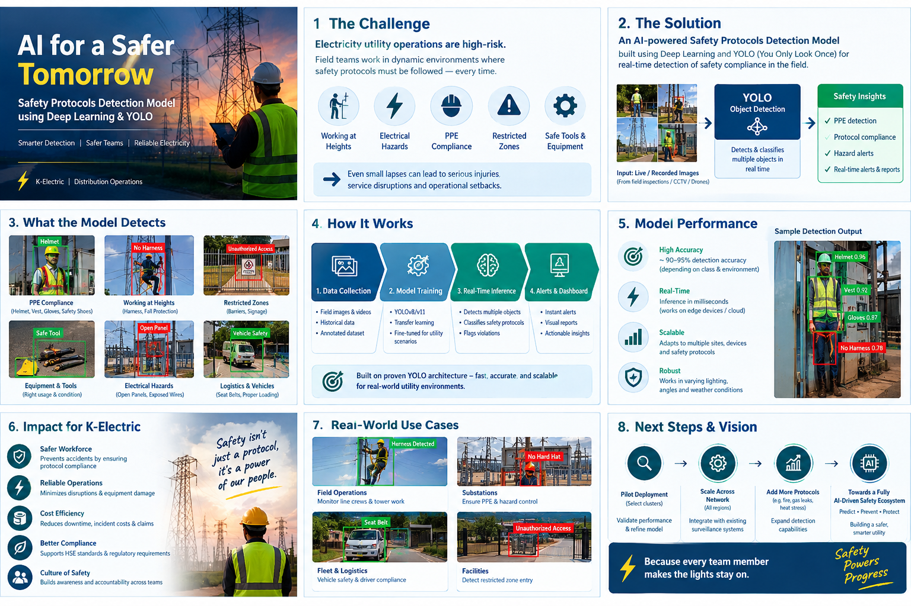

# AI for a Safer Tomorrow ⚡

## Safety Protocols Detection Model using Deep Learning & YOLO



## 📌 Project Overview

This project presents an AI-powered Safety Protocols Detection Model
developed using Deep Learning and YOLO-based Object Detection.

The objective is to leverage Computer Vision to automatically identify
safety compliance and potential safety violations in electricity utility
operations.

The model can analyze images and video footage from field operations and
detect objects and conditions related to electrical safety, PPE compliance,
working at heights, restricted areas, tools and equipment, and other
operational safety requirements.

## ⚡ Relevance to Electricity Utilities

Electricity distribution and transmission operations involve high-risk
activities where strict adherence to safety protocols is critical.

The proposed AI solution can support utility organizations by providing
automated visual monitoring of field activities and identifying potential
safety violations.

### Potential Applications and Future Developments

- 🦺 PPE compliance detection
- ⚡ Electrical hazard detection
- 🪜 Working-at-height safety monitoring
- 🚧 Restricted-zone/access detection
- 🛠️ Safety equipment and tools detection
- 🚗 Vehicle and field-operation safety monitoring
- 📹 CCTV/video-based safety monitoring
- 🚨 Automated safety alerts

## 🤖 Technology Stack

- Python
- Deep Learning
- Computer Vision
- YOLO Object Detection
- OpenCV
- PyTorch
- Roboflow
- Google Colab

## 🔄 Model Workflow

```text
Field Images / Video
        ↓
Data Collection & Annotation
        ↓
YOLO Model Training
        ↓
Model Validation
        ↓
Object Detection
        ↓
Safety Compliance Assessment
        ↓
Alerts & Insights
